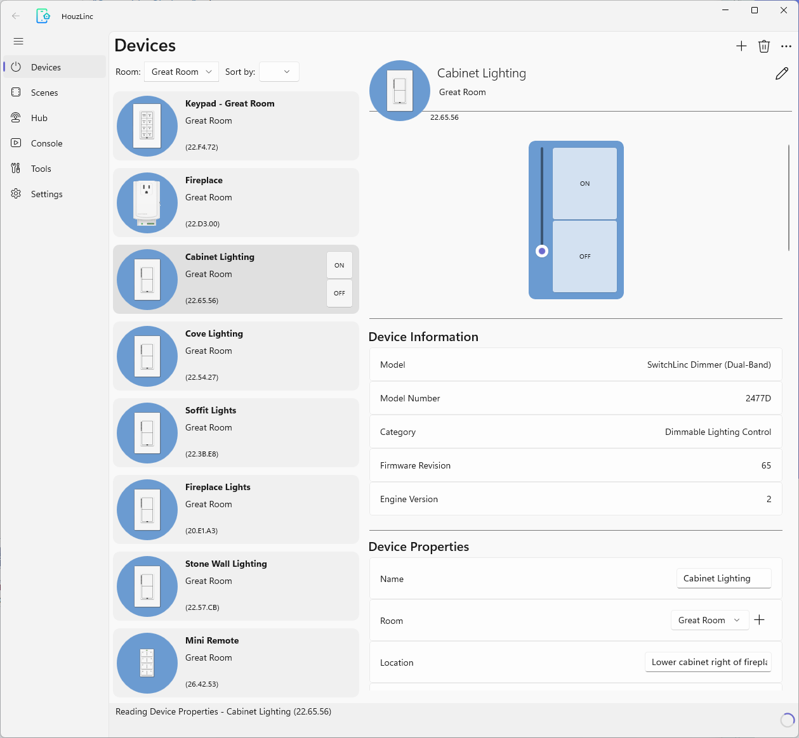

# HouzLinc

This project builds an application to program a network of Insteon devices. It leverages publicly available documentation on how to program the Insteon hub and Insteon devices on the local network. The concept is similar to the old Houselinc program for Windows that Insteon used to distribute some years ago.

I have a network of over 100 Insteon devices and more than 90 scenes in my house, which I configured back in 2013 using Houselinc. Transitioning to the new Insteon Director app (or its previous incarnation) was not straightforward, prompting me to develop my own app. I called it HouzLinc.

HouzLinc currently runs on Windows and Android. Porting it to iOS should be relatively straightforward (see below for why). On Windows HouzLinc takes advantage of the size of a laptop or desktop screen. On a phone, it works more like a mobile app.

HouzLinc does not require a service to run. It operates on a local machine connected to the same local network as the Insteon Hub. The house configuration representing the programming of the devices is stored in a single file that can reside on a local drive or on an online file service like Microsoft OneDrive, Google Drive, Dropbox, etc. (Only OneDrive is supported at this time). This ensures that the user's data remains under their control as well as private, always accessible, and transferrable to new house owners, renters, etc.

Multiple instances of HouzLinc can run simultaneously on different devices, sharing the same configuration file. This allows users to choose the most suitable device for their needs, whether it's a large screen or a mobile phone.

HouzLinc also offers the following:
- Updates to the configuration of scenes and devices are performed asynchronously, allowing users to continue making changes while previous updates are being applied to the devices.
- In addition to devices and scenes, HouzLinc shows the All-Links between devices. This facilitates investigating issues and fixing the links as needed. 
- HouzLinc includes a Console view which can be used to send commands directly to the hub or to individual devices, providing further investigation capabilities.
- Some handy batch operations are provided, such as removing or replacing a device, copying a device configuration to another, cleaning up after device removal, and so on. More can be added over time as the need arises.

This project is open source with an Apache license. As it is still in development, it contains bugs and limitations and usability can be improved in certain places. It has not been pushed to an app store yet, so it has to be built and side-loaded on Windows or Android. Contributions to fix issues, enhance or add functionality are welcome!

## Screenshots
Here is a screenshot of the app running on Windows:

<br>

And on Android:


## Architecture
HouzLinc is written as a C# application for the [Uno Platform](https://platform.uno/). Uno Platform allows creating single-codebase, cross-platform applications that can run on iOS, Android, Web, macOS, Linux and Windows. Uno achieves this by implementing the Windows App SDK on these other platforms. Uno apps use the Windows App SDK on Windows, and Uno's implementation of the same functionality on other platforms. All code is in C# and the UI is in XAML. The code and UI are virtually the same on all platforms.

This promotes a Windows first development approach, where development can occur on Windows in Visual Studio, using C# and XAML, and the code can be built and distributed to all the platforms supported by Uno. I currently have it building and running acceptably on Android. iOS is next!

### Layering
The following diagram shows HouzLinc high level architecture:


**Commands**: (namespace: `Insteon.Commands`) consists of an implementation of Insteon Hub and Device commands, using the Insteon Hub http interface. This layer abstracts the underlying details of the protocol and exposes a set of easily consumable command classes.

**Physical Device Drivers**: (`Insteon.Driver`) contain drivers for the physical devices on the Insteon Network. They expose the functionality supported by a class of devices, e.g., SwitchLinc or KeypadLinc, under a common API. There is an implementation of the API for the Insteon Hub (model 2242), as well as a generic device implementation supporting SwitchLinc, OutletLinc, I/OLinc, In-LineLinc, and others. A more specialized implementation handles KeypadLinc with 6 or 8 buttons and another handles RemoteLinc (Mini-Remote) with 4 channels.

**Model**: (`Insteon.Model`) this is the persisted model of devices, channels, scenes, etc. It is also called "House Configuration". It is persisted as an XML file. Consumers of the model can observe changes and react to them. This is used to update the UI layer and the persisted model. Changes to the model can also trigger background synchronization with the actual Insteon devices on the Insteon network using the drivers layer. The state is persisted in such a manner that even if the app is closed and restarted, synchronization will resume where it was interrupted. 

**Serialization**: (`Insteon.Serialization`) this reads and writes the model to a file. The current format is XML-based, more or less compatible with the old Houselinc.xml format. The model is converted to/from a different data structure for persistence, making it relatively easy to add new persistence formats in the future, such as JSON-based for example.

In addition to writing to and reading from a local file, HouzLinc can also work with a file on a personal Microsoft OneDrive. Currently the file name and location is fixed. The file is named houselinc.xml and is located in the `Apps\HouzLinc` folder off the root of your OneDrive.

There is an abstraction of Storage Providers (`StorageProvider` and derived classes) that should make supporting other storage services such Google Drive or Dropbox relatively easy, should the need arise.

**Model Persistence**: (`Insteon.Model`) When modified, the model generates change deltas that can be observed by either the View Model layer or by the persistence subsystem in the Model layer. The View Model layer uses these deltas to update the UI. The persistence subsystem uses them to apply changes to the persisted file and immediately release it to enable other instances of the app to persist their own changes, if any. This allows to run multiple instances of the app concurrently on different devices and have them share the same configuration file.

**View Model**: (`ViewModel.*`) the view model functions as it does in most MVVM applications, i.e., maintain a set of view oriented data on the model that is used by the UI layer. The view model gets notified of changes to the model and updates the UI using XAML databinding. It also receives user actions from the UI and applies them to the model.

**UI (View)**: (`UnoApp.*`) written in XAML, the UX uses XAML C# databinding to dynamically keep up to date with the View Model and reflects user changes to the View Model and Model layers. 

## Getting Started
HouzLinc is now available on the Microsoft Store, or as a sideloadable package on Windows and Android. To download and install HouzLinc, go to https://houzlinc.com. iOS support is coming soon!   

You can also build it yourself. You can build it on a Windows machine using Visual Studio 2022, and then either deploy it locally on that machine, or create a MSIX package and sideload it on any Windows machine with developer mode turned on.

You can also build it for Android and deploy it to a phone or an emulator using Visual Studio 2022.

The following sections contain instructions to set up your development environment, build, run and debug HouzLinc on Windows and Android.

### Repository and toolchain
First, you need to install the development environment, including the Uno Platform. Refer to the [Uno Platform documentation](https://platform.uno/docs/articles/get-started.html?tabs=windows) to get started with Uno Platform.

I used Visual Studio 2022 (currently, version 17.14.13). You can download Visual Studio Community from [here](https://visualstudio.microsoft.com/vs/community/). In theory, you should also be able to use VSCode if you prefer that IDE, but I have not had a chance to try it yet on this project.

Once your development environment is set up, clone the HouzLinc repository:
```
git clone https://github.com/christianfo/houzlinc.git
```
Look for Visual Studio solution file `HouzLinc.sln` at the root of the repo.

### Building, Running, and Debugging on Windows

#### Building and debugging in Visual Studio
Building and running the app in Visual Studio is straightforeward: select a configuration (`Debug` or `Release`), select `Any CPU` as the architecture and `HouzLinc (WinAppSDK Packaged)`  or `HouseLinc (WinAppSDK Unpackaged)` as the launch profile depending on whether you want to build a packaged or unpackaged app. Press F5 to build, deploy and debug the app, or Ctrl F5 to run without the debugger.
- Packaged app: once built, Visual Studio will deploy the app locally and run it. Once deployed, you can run that build directly from the Start menu.
- Unpackaged app: Visual Studio will build and run the app directly from the output directory (e.g., UnoApp\bin\Release\net9.0-windows10.0.26100). No installation is required. You can run the app directly from that folder by launching UnoApp.exe.

#### Building from the command line
##### Building an Unsigned App Package for Sideloading on Windows
Using Visual Studio `msbuild`, you can create an MSIX installer package that can be sideloaded on any Windows machine with developer mode turned on. Proceed as follows (see [here](https://platform.uno/docs/articles/uno-publishing-windows-packaged-unsigned.html) for more details):

1. In a Developer Powershell window (either View|Terminal or Tools|Command Line|Developer Powershell), navigate to the `UnoApp` folder where the `UnoApp.csproj` project file is located.
2. Run the following command to restore the correct dependency packages:
```
msbuild /r /t:Restore /p:Configuration=Release
```
3. Then run the following to build the package:
```
msbuild /p:TargetFramework=net9.0-windows10.0.26100 /p:Configuration=Release /p:Platform=x64 /p:PublishUnsignedPackage=true /p:AppxPackageDir="C:/temp/output/"
```
4. This creates an `.msix` file in the specified `AppxPackageDir>`, (e.g., `c:/temp/output/`), which you can install on your machine or any other machine with developer mode turned on. To install, open a vanilla Powershell window **running as administrator** and run the following:
```
Add-AppPackage -AllowUnsigned -path "<path to msix file>"
```
5. Then run HouzLinc by searching for it in the Start menu.

##### Building a App Package for Microsoft Store submission
To build a signed app package for Microsoft Store submission, use the following command instead of the one above:
```
msbuild /p:TargetFramework=net9.0-windows10.0.26100 /p:Configuration=Release /p:Platform=x64 /p:BuildForStore=true /p:AppxPackageDir="C:/temp/output/"
```
This creates an `.msix` file in the specified `AppxPackageDir`, (e.g., `c:/temp/output/`), which you can upload to the Microsoft Partner Center.

### Building, Running and Debugging on Android

#### Android Emulator
To build and deploy on the Android Emulator on in Visual Studio:
1. First make sure that you have the `.Net Multi-Platform App UI Development` workload installed in Visual Studio. If not, run the Visual Studio installer and modify the installation to include this workload.
1. Access the Device Manager in Visual Studio with Tools>Android>Android>Device Manager. Once there, create a new Android Virtual Device (AVD).
1. In Visual Studio, select `Any CPU` for the architecture, `Release` or `Debug` for the configuration, and select the virtual device you created under `Android Emulator` for the launch profile.
1. Hit F5 or the green "Play" button to build, deploy and run the app on the emulator.

#### Android Physical Device
##### Connecting via USB
1. Physically connect the device to your develepment computer via a USB cable.
2. Enable `Developer options` and enable `USB debugging` on the device

##### Connecting via Wifi
1. Make sure that the device and your development computer are on the same wifi network.
2. Enable `Developer options` and `Wireless debugging` on the device.
3. In the Wireless debugging options, click Pair device with paring code, note the IP address and port, and from a command window obtained in Visual Studio 2022 via Tools>Android>Android Adb Command Prompt, run:
```
adb pair <ip-address>:<port>
```
4. Now with the IP address and port indicated under `Wireless debugging`:
```
adb connect <ip-address>:<port>
```
##### Verifying the connection
Using a command window obtained in Visual Studio 2022 via Tools>Android>Android Adb Command Prompt:
```
adb devices
```
Ensure that your device is in the returned list.

#### Building and deploying from Visual Studio

1. Select the device under `Android Local Devices` as the launch profile.
2. Build, run and deploy HouzLinc to your device by pressing F5 in Visual Studio or the green "Play button".

#### Building and deploying from the command line and Adb
You can also build and deploy HouzLinc to an Android device from the command line using `dotnet` and deploy to your emulator or device using `Adb`. Here is how to do it:
1. If you are deploying to a device, connect it to your computer via USB and make sure USB debugging is enabled on the device.
2. Open a command prompt and navigate to the `UnoApp` folder where the `UnoApp.csproj` project file is located.
3. Build and publish the app using the following command:
```
    dotnet publish -f net9.0-android -c Release -o ./publish
```
4. Once this completed successfully, you will find the app package in the `publish` folder.
5. To install this package on your device, use a command prompt with Adb in your path (accessible via "Tools > Android > Android Adb Command Prompt" in Visual Studio 2022). First, verify your device is connected by running:
```
    adb devices
```
6. You should see your device or emualator listed, e.g. `e539f4b2`. If you do not see your device, make sure USB debugging is enabled and the device is connected.
7. Navigate to the `UnoApp` folder again and run the following command to install the app on the device, replacing `<yourdevice>` with the device id you obtained in the previous step:
```
    adb -s <yourdevice> install publish\com.lakesideapps.houzlinc-Signed.apk
```
8. HouzLinc should now be installed on your device. You can run it from the app drawer or home screen.

### Building, Running and Debugging on iOS
Coming soon!

### Other platforms
HouzLinc can be built for the Desktop framework and run on Windows or Mac that way. On Windows, just select the `HouseLinc(Destop)` launch profile in Visual Studio. Instead of using Windows App SDK / WinUI3, HouzLinc will use the Uno implementation of that framework. This offers a convenient environment to test on the Uno implementation of the Windows App SDK framework.

HouzLinc can also be built for WebAssembly and run in your favorite browser. Simply use the `HouseLinc(WebAssembly)` launch configration in Visual Studio. However [limitations on cross-site behavior](https://platform.uno/docs/articles/interop/MSAL.html) prevent signing in to OneDrive at this time. This means that HouzLinc cannot access the OneDrive configuration file when running in a browser, only local files. The Uno team proposes workarounds (see link above) that I have not yet tested.

I am also working on making HouzLinc run on MacOS and iOS.

### App Configuration
#### Enabling OneDrive sign-in
HouzLinc enables you to store the house configuration on OneDrive.

When GitHub builds the app from the repository using `release.yml`, it uses an application registration in Microsoft Entra ID (formerly Azure AD) to enable OneDrive sign-in. The client ID and redirect URI of that application registration are stored as GitHub secrets and injected into the build at build time by `release.yml`. Only people with permission to run the GitHub Actions workflow can access those secrets.

If you are building HouzLinc on your machine and want to enable saving the house configuration to OneDrive in your private build, you will need to register an application with Microsoft Entra ID to obtain a Client Id and, on certain platforms, a redirect URI. This is necessary to allow users to sign-in to OneDrive to grant Houzlinc access the house configuration file. Go to the [Azure portal](https://portal.azure.com/) and [register a new app](https://learn.microsoft.com/en-us/entra/identity-platform/quickstart-register-app?tabs=certificate) for Microsoft Entra ID. If you already have an application registered with Microsoft Entra, you can use that one instead. You will need the client Id and the redirect URI for a mobile app (Android, iOS).

Create a file named appsettings.json in the project UnoApp folder under your repo root:
```
<your repo root>/UnoApp/appsettings.json
```
Containing the following section:
```
"Msal": {
    "ClientId": "<Your MSAL client Id>",
    "AndroidRedirectURI": <Your Android Redirect URI>"
}
```
Where you enter your client Id and redirect URI for Android obtained from your Azure app registration.

Make sure to "Rebuild" the solution to ensure the build is picking up the new appsettings.json file.

Note that HouzLinc only asks for access to the `App\HouzLinc` folder in your OneDrive (scope: `Files.ReadWrite.AppFolder`). It does not have permission to read or write anything outside that folder. 

If you do not wish to use OneDrive, either do not create appsettings.json or leave out the Msal section.

The appsettings.json file contains developer-specific application configuration settings. Over time, more settings are likely to be added. Note that this file is not part of the repository (git ignored) since it contains custom settings which should remain private to you and should not be exposed (such as your Microsoft Entra Client Id).

#### Sync and Save buttons
As an optional feature, it is possible to show "Sync" and "Save" buttons on the bottom right of the window to force user confirmation when syncing the house configuration with network devices or saving the house configuration to a local or online file. These buttons are designed to help developers confirm the state before syncing or saving when working on new features.

To enable these buttons, add the following section to the appsettings.json file:

```
"FeatureFlags": {
    "EnableHouseSaveButton": true,
    "EnableHouseSyncButton": true,
  },
```

Rebuild and relaunch the app. The buttons will appear on the bottom right of the window.

### Unit Tests
The project currently contains some non-UI unit tests for the Insteon layer. These tests are written using the MSTest framework. They can be run in Visual Studio by selecting the `Test` menu and then `Run All Tests`. The tests are located in the `UnitTestApp` project.

Tests can also be built from the command line using msbuild. Navigate to UnitTestApp folder under the root of the repo and run the following command:
```
msbuild /p:TargetFramework=net9.0-windows10.0.26100 /p:Configuration=Release /p:Platform=x64 /p:PublishUnsignedPackage=true /p:AppxPackageDir="<output directory>" /v:minimal
```

### Upgrade to new Uno Platform versions
Change `global.json` file at the root of the repo to specify the desired Uno SDK version. Then either select  Tools > Options > NuGet Package Manager > General → Clear All NuGet Cache(s) in Visual Studio or run the following command from a Developer Powershell window in the root of the repo:
```
    dotnet nuget locals all --clear
```
Then restore restore Nuget packages either in VS via right clicking on the solution or by running:
```
    dotnet restore
```
Then erase all obj and bin folders, clear and rebuild the solution.

### Contribution
You are welcome to submit pull requests to the 'main' branch. For now, I will be the sole approver of changes. I am in the process of building a pipeline for building and validating changes. Currently, this process is manual, and must be handled by me.

### Notes and Limitations
Includes but not limited to:
- Only i2 devices are supported (Insteon Engine vs. 2). i1 can be discovered but synchronization has a number of issues. I have not tested with i3 devices yet.
- Schedules are not supported for lack of public documentation on how to create them in the Hub. Would welcome Insteon sharing the protocol.
- Making the Android emulator work acceptably: [see here](https://stackoverflow.com/questions/69134922/google-chrome-browser-in-android-12-emulator-doesnt-load-any-webpages-internet#:~:text=It%27s%20caused%20by%20vulkan.%20To%20fix%20it%2C%20you,exist%20already%29%3A%20Vulkan%20%3D%20off%20GLDirectMem%20%3D%20on).
- Detaching the load on a keypadlinc is not supported. We could support it but it is very limited because there is no way to control the load from one of the buttons on the keypadlinc in that configuration.

### Future Work
[See in Github](https://github.com/Lakeside-Apps/HouzLinc/issues?q=is%3Aissue%20state%3Aopen%20type%3AFeature)

